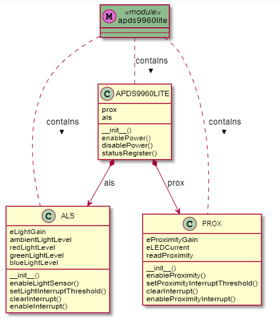

.. If you created a package, create one automodule per module in the package.
uPy_APDS9960 Module
-------------------

class diagrams
~~~~~~~~~~~~~~

.. automodule:: uPy_APDS9960.apds9960lite
   :members:

