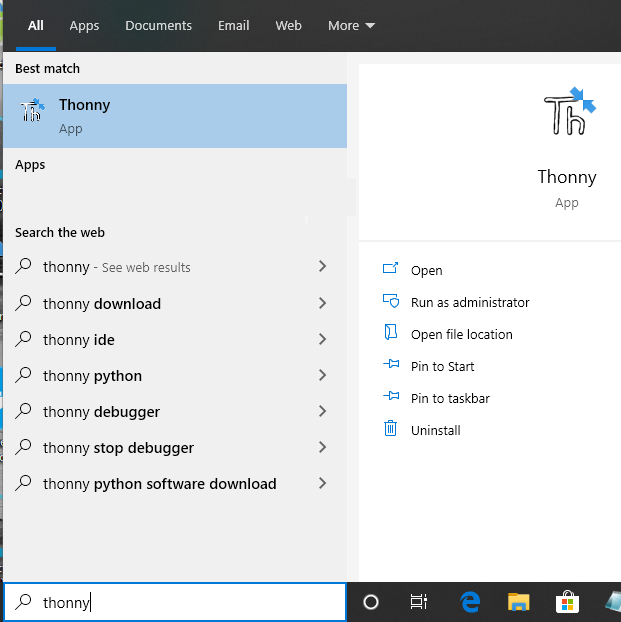
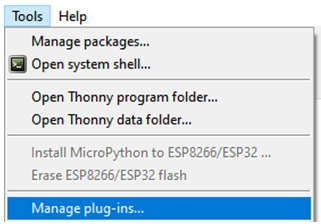
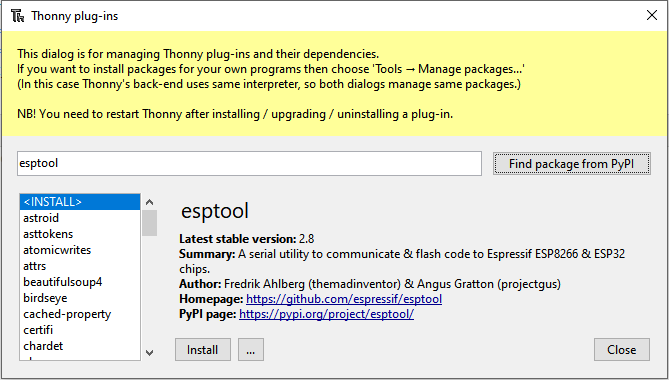
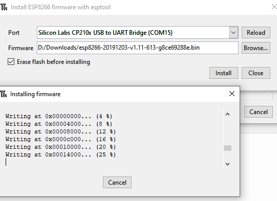
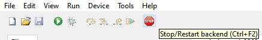
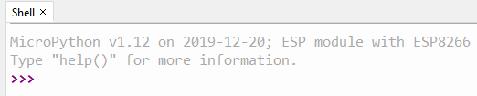
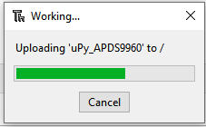
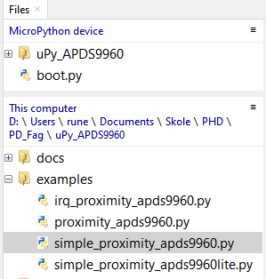
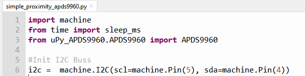
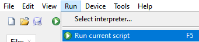

Thonny IDE Turorial
===================

This is a short visual tutorial on how to use the `Thonny IDE <http://thonny.org/>`_  to flash the ESP8266 chip and upload and test the uPy_APDS9960 library

Download and install
--------------------
The latest version of tonny can be found at `thonny.org <http://thonny.org/>`_ 

In this tutorial we uses the `windows version <https://github.com/thonny/thonny/releases/download/v3.2.4/thonny-3.2.4.exe>`_
and install Thonny on your computer

Download up Micropython (ESP8266) dev enviroment
~~~~~~~~~~~~~~~~~~~~~~~~~~~~~~~~~~~~~~~~~~~~~~~~

Download latest `MicroPython firmware for ESP8266 <http://micropython.org/download#esp8266>`_

Start Thonny
------------

Flash new firmware
------------------

Installing esptool.py
~~~~~~~~~~~~~~~~~~~~~
From the menu "Tools" select "Manage Plut-ins..."

In the text field enter "esptool" and click the button "Find packages from PyPI"

Click the "Install" button to finish the esptool installation

Seting up Micropython (ESP8266) dev enviroment
~~~~~~~~~~~~~~~~~~~~~~~~~~~~~~~~~~~~~~~~~~~~~~

From the menu "Run" select "Select intepreter..."

.. image:: images/thonny/select_intep.PNG
  :alt: Select python intepreter to ESP8266

The ESP8266 firmware install/upgrade dialog is shown

.. image:: images/thonny/ESP8266_FirmwareUp_Box1.PNG
  :alt: Shows ESP8266 firmware options dialog

Make sure thet the ESP8266 development kit is connected.
Select the "port dropdown" arrow to select the serial port for flashing the ESP8266.

.. image:: images/thonny/ESP8266_FirmwareUp_Box2.PNG
  :alt: Shows ESP8266 firmware options dialog

In the "Firmware" text field select the .bin file that was `downloaded <http://micropython.org/download#esp8266>`_ and click the install button

Click the stop icon to reset and connect to the ESP8266 board

Now you should be up and running as shown in the thonny shell windows

Running the examples
--------------------

Start by uploadting the uPy_APDS9960 library.

Uploading uPy_APDS9960
~~~~~~~~~~~~~~~~~~~~~~

From the files windows under "This computer" right click on the folder "uPy_APDS9960" and from the dropdown menu select "Upload to /" 

.. image:: images/thonny/UploadModule.PNG

Running a example program
~~~~~~~~~~~~~~~~~~~~~~~~~

From the files windows under "This computer"  click on the '+' sign infront of the folder "examples" to expand it.

Double clikc on the file simple_proximity_apds9960.py and it wil be open the the editor

You are now ready to run the program entring F5 or selecting the menu "Run" and "Run current script"

Click the stop icon to stop the program and return the command prompt

Have fun :)